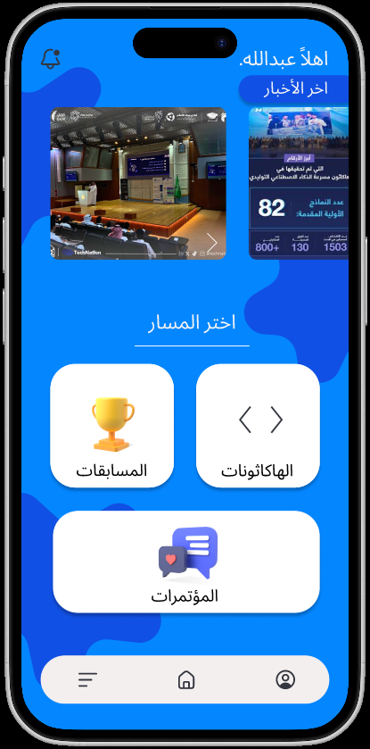

# Daleel (دليل) – Academic & Event Platform

###  Overview
**Daleel** is an end-to-end e-business platform designed to bridge the engagement gap among IT and CIS university students. It serves as a centralized hub connecting students with events, hackathons, and student clubs while using decision-tree logic and matching algorithms to facilitate optimal team formation and career role identification.

---

###  Problem Statement & Market Opportunity
- **The Issue:** A noticeable drop in student competition achievements due to fragmented event information and a lack of self-awareness regarding core skills.
- **The Gap:** Existing university portals lack continuous updates, personalized recommendations, and automated team-matching capabilities.
- **The Solution:** A smart, unified platform that offers tailored event discovery, team-matching based on complementary skill sets, and a personalized role-assessment test.

---

###  Key Features & System Design
- **Smart Team Matching Algorithm:** Analyzes skill compatibility scores and matches students based on missing team skill requirements.
- **Role Assessment Test (Decision Tree Logic):** A 10-question sequential logic quiz that determines the student's optimal role (e.g., Developer, Designer, Leader, Strategist).
- **Centralized Event & Club Hub:** Categorized streams for Hackathons, Conferences, and Competitions with integrated registration links.
- **Student Skill Profiles:** Showcase student portfolios, past achievements, and verified skills for networking.

---

###  Business Strategy & Product Management Artifacts
- **Business Model Canvas (BMC):** Defined value proposition, key revenue streams (in-app ads, club subscriptions, non-personal data insights), and operating cost structure.
- **Competitive Analysis:** Evaluated conventional university portals vs. Daleel's unique selling points (automated recommendation & interactive team formation).
- **Product Roadmap:** Planned a 3-phase rollout strategy ranging from MVP launch (single university focus) to cross-university integrations and recruitment marketplace bridges.

---

###  Tech Stack & Methods
- **Algorithms & Security:** Decision Tree Logic, Keyword Matching Engine, Scrypt Hashing Algorithm.
- **Analysis & Modeling:** Business Model Canvas (BMC), User Journey Mapping, Competitor Analysis, Functional Requirements.
- **UI/UX Design:** Figma (High-Fidelity Wireframes & Interactive Prototypes).

---

###  Deliverables & Documents
-  **Presentation & Pitch Deck:** [View Pitch Deck PDF](Daleel.pdf)
-  **Figma Prototype:** https://www.figma.com/design/XlX0QMe3iCs8dorHEPAiNo/Untitled?node-id=0-1&t=QEF3gumK11GShsj2-1
